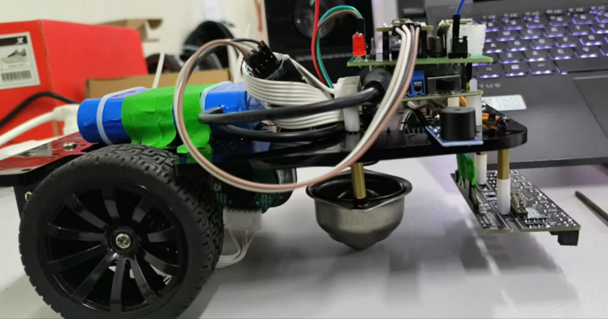
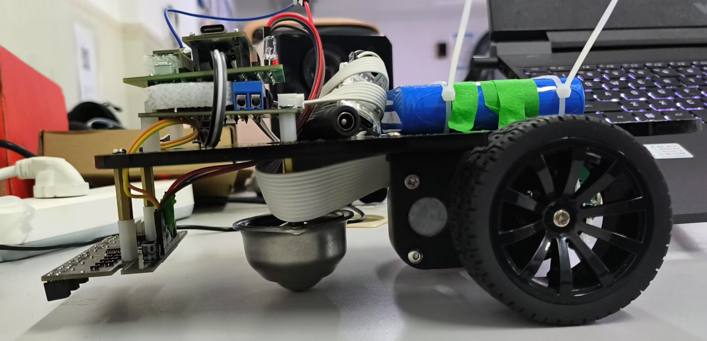
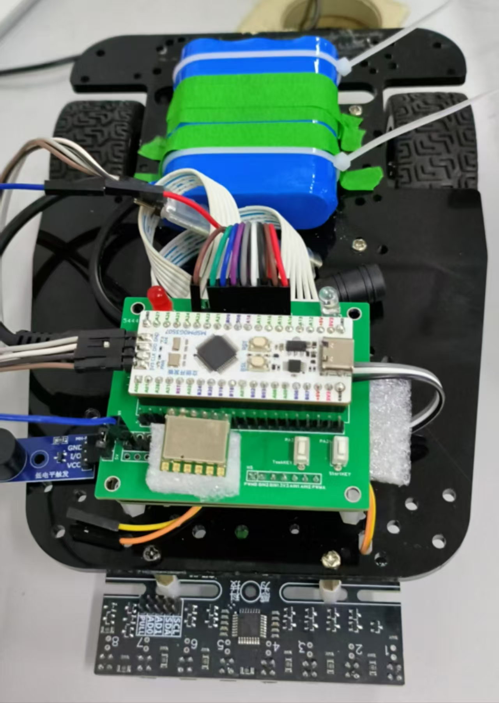
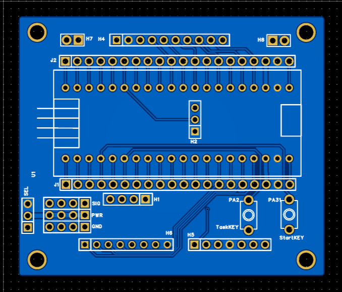

# 🚗 Inertial Navigation + Line-Following Autonomous Car - 24th National Undergraduate Electronics Design Contest Problem H
## Competition Run Result: Task 4 Completed in 35 Seconds

## [Bilibili Video Demo](https://www.bilibili.com/video/BV1xQNzzUEWS/?spm_id_from=333.1387.homepage.video_card.click)
## [LCEDA Open Source Project](https://u.lceda.cn/account/user/projects/index/members?project=a21ed0727ad447719ecbd93959d565b7&folder=all)

## This project is developed based on the **TI MSPM0G3507** microcontroller, aiming to achieve high-precision distance positioning, directional control, and line-following for the car on complex tracks through sensor fusion control of the **JY901S gyroscope**, **motor encoders**, and **8-channel grayscale sensors**.

---

## 🏎️ Core Algorithm Logic

This project adopts a **layered modular** design approach combined with a **Finite State Machine (FSM)**.

### 1. Basic Action Primitives
We break down complex tasks into four reusable action modules:
* **Straight Mode (Gyro Straight)**: Utilizes the JY901S gyroscope for yaw angle feedback, implementing a yaw angle closed loop via `AnglePidCtrl` to maintain heading in unguided areas.
* **Line Tracking Mode**: Samples data from the 8-channel grayscale sensors and uses a position PID algorithm to real-time adjust the servos/differential speed.
* **Fixed-Distance Travel (Encoder Odometer)**: Integrates physical displacement based on Hall encoder data for distance control in diagonal crossing tasks.
* **Node Trigger (Event Trigger)**: Uses `Line_flag` state switching and audio-visual feedback (buzzer + LED) to ensure physical confirmation of node arrival.

---

## 📋 Task Implementation Details

### ■ Task 1: Directed Straight Travel and Boundary Recognition
* **Control Chain**: `Record Initial Angle` -> `Gyroscope Closed-Loop Straight Travel` -> `Grayscale Edge Detection` -> `Braking Feedback`.
* **Key Point**: Leverages the gyroscope to compensate for drifting caused by mechanical structural asymmetry.

### ■ Task 2: Mixed-Mode Loop (S-Curve/Loop)
* **Core Logic**: Employs a loop state machine following the **Straight-Track-Straight-Track** sequence.
* **Switching Mechanism**: Uses `line_flag` to detect black line boundaries in real-time. Automatically switches to tracking PID upon entering the black line area, and immediately switches back to angle closed-loop control upon leaving (detecting all white), mitigating loss-of-control risks at curve transitions.

### ■ Task 3: Asymmetric Diagonal Crossing
* **Motion Model**: `Rotate in Place` -> `Fixed-Distance Travel` -> `Line Contact Tracking`.
* **Technical Details**: Pre-sets `angle3/angle4` target angles and records mileage via encoders. Begins "scanning" for the black line after reaching the preset distance to achieve a diagonal entry into the tracking trajectory.

### ■ Task 4: High-Speed Dynamic Compensation Loop
* **Optimization Strategy**:
    1.  **Speed Gain**: Significantly increases the `basespeed` baseline and matches it with high-frequency response PID parameters.
    2.  **Dynamic Compensation Table**: Addresses accumulated physical inertia errors at high speeds by dynamically adjusting target angles and mileage per lap using a Lookup Table method.
    3.  **Non-Blocking Execution**: The entire process uses a step-by-step state machine to ensure sensor sampling frequency is not interfered with by logic delays.

---

## 🛠️ Control Schemes

The project integrates multiple closed-loop control systems:

| Control Loop | Input Sensor | Output Target | Core Function |
| :--- | :--- | :--- | :--- |
| **Angle Loop (Angle PID)** | JY901S (Yaw) | Left/Right Motor Differential Speed | Maintains absolute heading, corrects physical deviations |
| **Tracking Loop (Track PID)** | 8-Channel Grayscale Sensors | Left/Right Motor Differential Speed | Fits the deviation from the black line center for precise line tracking |

---

## 🚀 Performance Optimization Highlights

* **State Machine Decoupling**: Abstracts the logic for Task 3 and Task 4, managing them through a single executor to reduce maintenance complexity.
* **Lookup Table Compensation**: Uses arrays to manage per-lap correction values (angle, distance) in Task 4, eliminating the need to modify code logic during debugging.
* **Defensive Programming**: Introduces `TimeLimit` timeout protection and a unified `Task_Reset` cleanup function to enhance system robustness.

---

## 💡 Usage and Debugging Tips
1.  **Static Calibration**: Ensure the car is stationary before starting a task to calibrate the gyroscope zero point.
2.  **Compensation Fine-Tuning**: If drift occurs in Task 4, you can directly modify the `d_angle` and `d_dis` compensation arrays in `task.c`.
3.  **Mode Switching**: After switching `task_num` via the button, press the start button to enter the corresponding state machine.

## Electronic Modules

- [LCEDA DiMengStar MSPM0G3507 Main Control Board (Contest Discount: 30 RMB)](https://item.szlcsc.com/24478333.html?lcsc_vid=T1FaUVcAFQVXUVJUFAAPBFxTFVUKVAJQRgdXVwBRQVQxVlNSTlJXU1xSTldYUjsOAxUeFF5JWBYZEEoEHg8JSQcJGk4%3D)
- [R3X Series Three-Wheeled Car Model 106](https://item.taobao.com/item.htm?abbucket=6&detail_redpacket_pop=true&id=594481149003&mi_id=pjm_3wdTOvIPm7CIgRB8acNJtRmhUg0QKlvNVEXEoqaUKQQcYXTunwaisg57dwZ8TJxVVdM_qmXcacvM4wDxoBFK3fBJSjP0Tssh-nWKQx4&ns=1&priceTId=213e072c17493950995278926e10a3&query=R3X%E7%B3%BB%E5%88%97&skuId=5067668637755&spm=0.0.hoverItem.1&utparam=%7B%22aplus_abtest%22%3A%22ec5ee9e66e9d947a27c2d559ba93f412%22%7D&xxc=taobaoSearch)
- [MG513 Motor, 13-Pulse Hall Encoder](https://item.taobao.com/item.htm?abbucket=6&detail_redpacket_pop=true&id=594481149003&mi_id=pjm_3wdTOvIPm7CIgRB8acNJtRmhUg0QKlvNVEXEoqaUKQQcYXTunwaisg57dwZ8TJxVVdM_qmXcacvM4wDxoBFK3fBJSjP0Tssh-nWKQx4&ns=1&priceTId=213e072c17493950995278926e10a3&query=R3X%E7%B3%BB%E5%88%97&skuId=5067668637755&spm=0.0.hoverItem.1&utparam=%7B%22aplus_abtest%22%3A%22ec5ee9e66e9d947a27c2d559ba93f412%22%7D&xxc=taobaoSearch)
- [Taker Innovation TB6612 Motor Driver Module (with Voltage Regulator) 32](https://detail.tmall.com/item.htm?abbucket=6&detail_redpacket_pop=true&id=838447196772&mi_id=siKALv5wjie-yYUBE-IVqV-UB3oQwq3xOE8aac6D70byqCH5ItorhEekR0iCcAph1wotNwf34ZagCBznm7LR8NNRLM12lvQadeMVY_sf1jk&ns=1&priceTId=214783e817493949527707361e1a20&query=tb6612&skuId=5768034939590&spm=0.0.hoverItem.5&utparam=%7B%22aplus_abtest%22%3A%22e8403ea3594e59933b3f71dfc730708a%22%7D&xxc=taobaoSearch)
- [CY-25A Stainless Steel Omni-directional Wheel 3](https://detail.tmall.com/item.htm?detail_redpacket_pop=true&id=920100840332&mi_id=epwPtrxkVMrelcqHujFt0e9XD4ITbxtjdmLWq_L19isYbIlpDIRHuKB86I6f-aw_n_TMV77humU2An5SDXYHnDHI1QfqQ9wywXWdhUWY-QM&ns=1&priceTId=213e04e317493951707026702e1b5c&query=CY-25A%E7%89%9B%E7%9C%BC%E8%BD%AE&skuId=5956436590665&spm=0.0.hoverItem.1&utparam=%7B%22aplus_abtest%22%3A%22fb0e66b1318b2df87158299a8cdeae64%22%7D&xxc=ad_ztc)
- [5mm LED Lamp 2](https://item.taobao.com/item.htm?priceTId=213e074c17493952331733256e1868&utparam=%7B%22aplus_abtest%22%3A%2263bc95f97487b421d21e3e1978b63be0%22%7D&id=674866929367&ns=1&abbucket=6&xxc=taobaoSearch&detail_redpacket_pop=true&query=LED&mi_id=nMsTCZnDuKts4aI2Jfjcs4ZvLa-3uj5vLtexTfsLyTvx094uGp2_J9Nx0tSSxsNFiFhrQ2HRyoHkfxFub8RUt1Lfji8ul0-j3LmxzOz0klY&skuId=5029993387531&spm=0.0.hoverItem.3)
- [Push Button 2](https://item.taobao.com/item.htm?abbucket=6&detail_redpacket_pop=true&id=45677272349&mi_id=8YeMF2cxCvCryAGyCOxwqNjs6MPl1y6sr5S8RBybHpdLmuZjPBXIalJ7QOGkvcpRV--W9cRKMob5E8ToT3Vd8Cu6EWLEbCBUmGUDw_3Pmfw&ns=1&priceTId=213e074c17493954752601732e1868&query=%E6%8C%89%E9%94%AE&skuId=5111169289732&spm=0.0.hoverItem.2&utparam=%7B%22aplus_abtest%22%3A%22ed48affb0907688d013cd84d8e9a021c%22%7D&xxc=taobaoSearch)
- [Active Buzzer (Low-Level Trigger) 3](https://detail.tmall.com/item.htm?abbucket=6&detail_redpacket_pop=true&id=656159590251&mi_id=8Zq8mLmWJimuoc6RV53ezAIcBCsXfM5zNCMf1qzxTUBuuuLpt751MK60wpK3RcXiDsjiMrkIBFPtLyaaJ8Yj6-xh9YwiDTAXNeFDxUzouR0&ns=1&priceTId=213e074c17493955656236350e1868&query=%E6%9C%89%E6%BA%90%E8%9C%82%E9%B8%A3%E5%99%A8&skuId=5528205093524&spm=0.0.hoverItem.2&utparam=%7B%22aplus_abtest%22%3A%221c2c9d893101f833747e7d34cf88d8b5%22%7D&xxc=taobaoSearch)
- [JY901S Gyroscope 95](https://item.taobao.com/item.htm?abbucket=6&detail_redpacket_pop=true&id=634627673077&mi_id=4Kb87-z7TCx2-DuZBA56ROhXsyTLYCrWl6l3UglVKY-xE590neXJVL8gisLgBI8V0c3kANH6-0mKgDesihpaM75EdhCf3QxuAOlFRwjFuYA&ns=1&priceTId=213e044b17493956041348474e1ad6&query=jy901s&spm=0.0.hoverItem.2&utparam=%7B%22aplus_abtest%22%3A%226236e30c9cf4fa25a4801a56e6362764%22%7D&xxc=taobaoSearch)
- [8-Channel Grayscale Sensor 75](https://item.taobao.com/item.htm?priceTId=214781c017493956529718475e1276&utparam=%7B%22aplus_abtest%22%3A%22e86892cadfe917d1c232a5338da27738%22%7D&id=700000730878&ns=1&abbucket=6&xxc=taobaoSearch&detail_redpacket_pop=true&query=%E6%95%A2%E4%B8%BA%E7%A7%91%E6%8A%80%E7%81%B0%E5%BA%A6%E4%BC%A0%E6%84%9F%E5%99%A8&mi_id=p3He12ED41BoUwQOr7vR21XaLhReCuepgX4MajEkEOxjyq5xV9Y_moLfE82nuwRw_kPHd1LA84ykjoJCPls3oy6Z6cMh0HvyamA4lBNaC2I&skuId=5768776477755&spm=0.0.hoverItem.3)
- [12V Lithium Battery 22](https://item.taobao.com/item.htm?id=562015429673)
