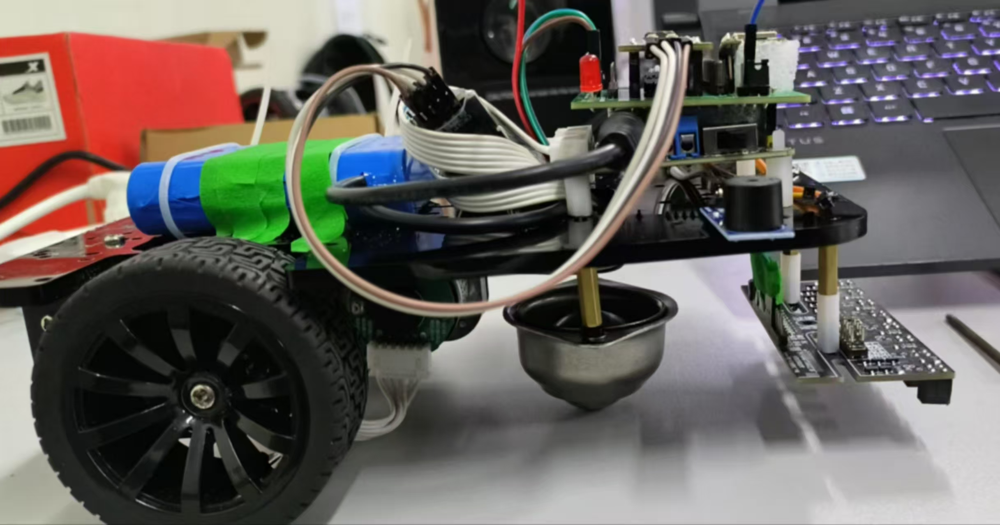
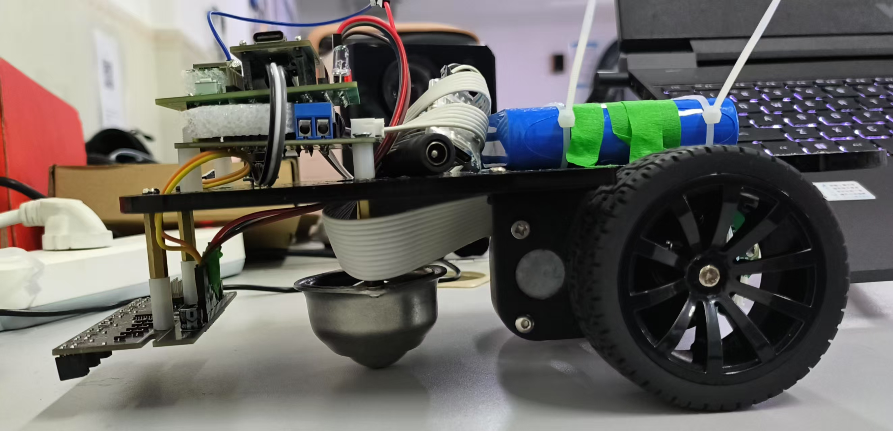
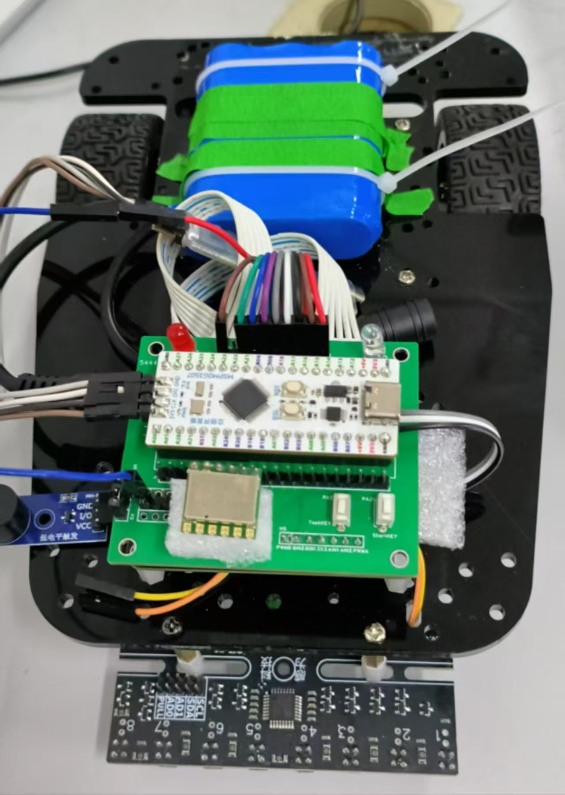
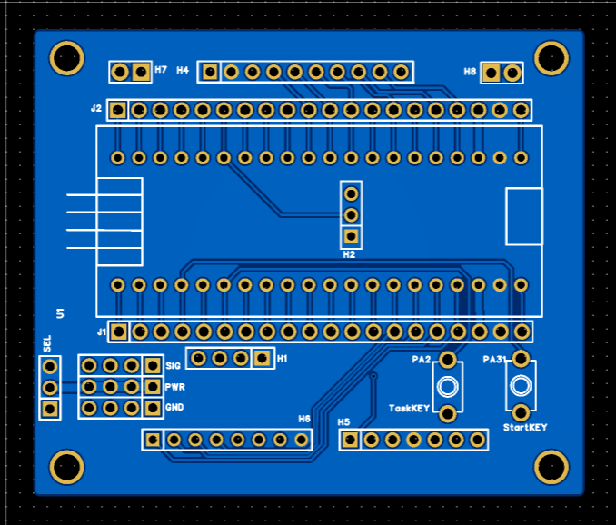

# 2024电子设计大赛H题智能小车
## 校赛完赛，实测第4问寄录35秒

## [PCB开源地址](https://u.lceda.cn/account/user/projects/index/members?project=a21ed0727ad447719ecbd93959d565b7&folder=all)
## [B站测评视频](https://www.bilibili.com/video/BV1bTVPz3E2n/?share_source=copy_web&vd_source=7fe9629c8866b638fabb43851d093cad )
## 电子模块

- 立创地猛星MSPM0G3507主控板
- R3X系列三轮小车车模
- MG513电机、13线霍尔编码器
- 塔克创新Tb6612电机驱动模块(带稳压)
- CY-25A牛眼轮
- LED灯和按键各两个
- 有源蜂鸣器(低电平触发)
- JY901S陀螺仪
- 8路灰度传感器
- 12V锂电池

## 任务点实现思路

### ■  任务1
- 将任务选择按键切换至“任务点1”，按下启动按键。
- 等待小车记录初始角度 angle_initial，此时标志位 Line_flag = 0。
- 记录完成后，小车以设定速度前进，并基于 JY901S 陀螺仪数据进行角度闭环控制，保持以初始角度直行。
- 同时启用灰度传感器检测黑线，一旦检测到黑线，执行刹停操作，并通过蜂鸣器与 LED 灯进行声光反馈。

### ■  任务2
- 将任务选择按键切换至“任务点2”，按下启动按键。

- 等待小车记录初始角度 angle_initial，此时标志位 Line_flag = 0。

- 记录完成后，小车以设定速度前进，并基于 JY901S 陀螺仪数据进行角度闭环控制，保持以初始角度直行。

- 同时启用灰度传感器检测黑线，一旦检测到黑线，设置标志位 Line_flag = 1，同时触发声光反馈。

- 当 Line_flag = 1 时，小车进入寻迹模式，使用灰度传感器结合 PID 控制实现巡线行驶。

- 寻迹完成后，将 Line_flag 设为 0，再次触发声光反馈，小车重新进入直行模式，继续基于陀螺仪的角度闭环控制。

- 再次检测到黑线后，执行声光反馈操作，将 Line_flag 设为 1，重复步骤 5~6 的寻迹流程。

### ■ 任务3
-  将任务选择按键切换至“任务点3”，按下启动按键。

- 等待小车记录初始角度 angle_initial，此时标志位 Line_flag = 0。

- 记录完成后，小车以 angle3(angle4) 为目标角度，在TimeLimit时限内原地右转，之后打开电机编码器，基于 JY901S 陀螺仪进行角度闭环控制，开始直行。

- 在直行过程中记录行驶里程，达到目标里程后，调整方向，以 8° (-5°) 为目标继续直行。同时启用灰度传感器检测黑线，一旦检测到黑线，设置标志位 Line_flag = 1，触发声光反馈。

- 当 Line_flag = 1 时，小车进入寻迹模式，使用灰度传感器结合 PID 控制实现巡线行驶。

- 寻迹完成后，将 Line_flag 设为 0，并再次触发声光反馈。

- 重复执行上述流程，实现循环运行。

### ■ 任务4
- 基于任务3的逻辑实现，提高电机给定速度。
- 执行完整的任务3流程共 4 次，每次均包含角度记录、直行、里程判断、黑线检测、寻迹等完整动作。