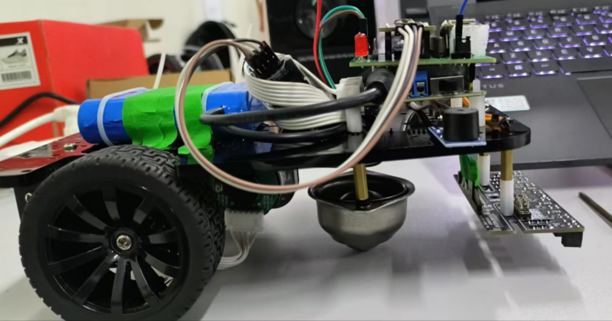
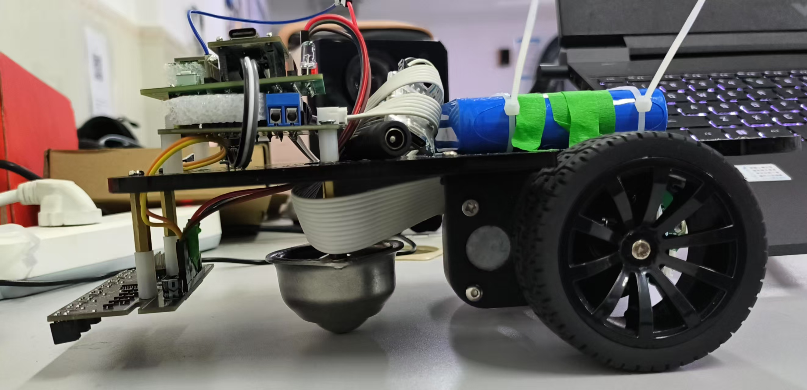
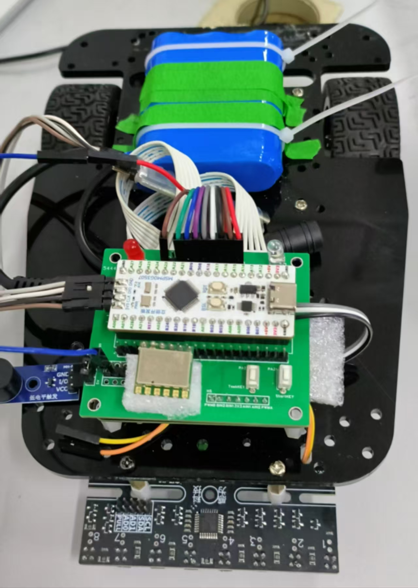
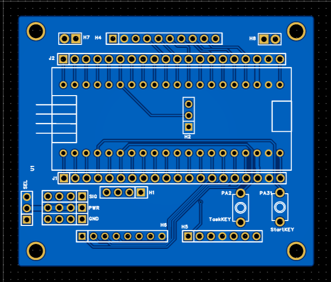

# 🚗 惯性导航+巡线自动行驶小车 -24电赛H题
## 完赛实测：任务四总用时35秒

## [bilibili视频演示](https://www.bilibili.com/video/BV1xQNzzUEWS/?spm_id_from=333.1387.homepage.video_card.click)
## [嘉立创EDA开源](https://u.lceda.cn/account/user/projects/index/members?project=a21ed0727ad447719ecbd93959d565b7&folder=all)

## 本项目基于 **TI MSPM0G3507** 微控制器开发，旨在通过 **JY901S 陀螺仪**、**电机编码器**以及 **8 路灰度传感器**的融合控制，实现小车在复杂赛道上的高精度定距、定向及巡线行驶。

---

## 🏎️ 核心算法逻辑 (Development Logic)

本项目采用**分层模块化**与**有限状态机 (FSM)** 的设计思想。

### 1. 基础动作原子 (Action Primitives)
我们将复杂的任务拆解为四个可重用的动作模块：
* **直行模式 (Gyro Straight)**：利用 JY901S 陀螺仪提供偏航角反馈，通过 `AnglePidCtrl` 实现偏航角闭环，确保在无引导区保持航向。
* **寻迹模式 (Line Tracking)**：采样 8 路灰度传感器数据，通过位置 PID 算法实时修正舵机/差速。
* **定距行驶 (Encoder Odometer)**：基于霍尔编码器数据进行物理位移积分，用于斜穿任务的里程控制。
* **节点触发 (Event Trigger)**：通过 `Line_flag` 状态切换和声光反馈（蜂鸣器+LED）确保节点到达的物理确认。

---

## 📋 任务实现说明 (Task Implementation)

### ■ 任务 1：定向直行与边界识别
* **控制链**：`记录初始角` -> `陀螺仪闭环直行` -> `灰度边缘检测` -> `刹停反馈`。
* **要点**：利用陀螺仪补偿机械结构不对称带来的跑偏问题。

### ■ 任务 2：混合模式循环 (S型/环形)
* **核心逻辑**：采用 **直行-寻迹-直行-寻迹** 的循环状态机。
* **切换机制**：通过 `line_flag` 实时捕捉黑线边界。进入黑线区自动切换为寻迹 PID，离开黑线区（检测到全白）立即切回角度闭环，解决弯道衔接处的失控风险。

### ■ 任务 3：非对称对角线穿越
* **运动模型**：`原地旋转` -> `定距行驶` -> `触线寻迹`。
* **技术细节**：预设 `angle3/angle4` 目标角，通过编码器记录里程。在到达预设距离后开始“探测”黑线，实现斜向切入巡线轨迹。

### ■ 任务 4：高速动态补偿循环
* **优化策略**：
    1.  **速度增益**：显著提升 `basespeed` 基准，并匹配高频响应 PID 参数。
    2.  **动态补偿表**：针对高速行驶下的物理惯性累积误差，通过查表法（Lookup Table）随圈数动态调整目标角度与里程。
    3.  **非阻塞执行**：全流程采用步进状态机，确保传感器采样频率不受逻辑延时干扰。

---

## 🛠️ 控制方案 (Control Schemes)

项目中集成了多套闭环控制系统：

| 控制环路 | 输入传感器 | 输出目标 | 核心作用 |
| :--- | :--- | :--- | :--- |
| **角度环 (Angle PID)** | JY901S (Yaw) | 左右电机差速 | 保持绝对航向，修正物理偏移 |
| **寻迹环 (Track PID)** | 8路灰度传感器 | 左右电机差速 | 拟合黑线中心偏差，精准巡线 |

---

## 🚀 性能优化亮点 (Optimization)

* **状态机解耦**：将 Task 3 与 Task 4 逻辑抽象化，通过同一个执行器管理，降低了维护难度。
* **查表法补偿**：在 Task 4 中使用数组管理每圈的修正值（角度、距离），调试时无需修改代码逻辑。
* **防御性编程**：引入 `TimeLimit` 超时保护与 `Task_Reset` 统一清理函数，增强系统健壮性。

---

## 💡 使用与调试建议
1.  **静态校准**：启动任务前请确保小车静止，以校准陀螺仪零位。
2.  **补偿微调**：若 Task 4 出现漂移，可直接修改 `task.c` 中的 `d_angle` 和 `d_dis` 补偿数组。
3.  **模式切换**：通过按键切换 `task_num` 后，按下启动键即可进入对应的状态机。

## 电子模块

- [立创地猛星MSPM0G3507主控板（电赛优惠价30块)](https://item.szlcsc.com/24478333.html?lcsc_vid=T1FaUVcAFQVXUVJUFAAPBFxTFVUKVAJQRgdXVwBRQVQxVlNSTlJXU1xSTldYUjsOAxUeFF5JWBYZEEoEHg8JSQcJGk4%3D)
- [R3X系列三轮小车车模 106](https://item.taobao.com/item.htm?abbucket=6&detail_redpacket_pop=true&id=594481149003&mi_id=pjm_3wdTOvIPm7CIgRB8acNJtRmhUg0QKlvNVEXEoqaUKQQcYXTunwaisg57dwZ8TJxVVdM_qmXcacvM4wDxoBFK3fBJSjP0Tssh-nWKQx4&ns=1&priceTId=213e072c17493950995278926e10a3&query=R3X%E7%B3%BB%E5%88%97&skuId=5067668637755&spm=0.0.hoverItem.1&utparam=%7B%22aplus_abtest%22%3A%22ec5ee9e66e9d947a27c2d559ba93f412%22%7D&xxc=taobaoSearch)
- [MG513电机、13线霍尔编码器](https://item.taobao.com/item.htm?abbucket=6&detail_redpacket_pop=true&id=594481149003&mi_id=pjm_3wdTOvIPm7CIgRB8acNJtRmhUg0QKlvNVEXEoqaUKQQcYXTunwaisg57dwZ8TJxVVdM_qmXcacvM4wDxoBFK3fBJSjP0Tssh-nWKQx4&ns=1&priceTId=213e072c17493950995278926e10a3&query=R3X%E7%B3%BB%E5%88%97&skuId=5067668637755&spm=0.0.hoverItem.1&utparam=%7B%22aplus_abtest%22%3A%22ec5ee9e66e9d947a27c2d559ba93f412%22%7D&xxc=taobaoSearch)
- [塔克创新Tb6612电机驱动模块(带稳压) 32](https://detail.tmall.com/item.htm?abbucket=6&detail_redpacket_pop=true&id=838447196772&mi_id=siKALv5wjie-yYUBE-IVqV-UB3oQwq3xOE8aac6D70byqCH5ItorhEekR0iCcAph1wotNwf34ZagCBznm7LR8NNRLM12lvQadeMVY_sf1jk&ns=1&priceTId=214783e817493949527707361e1a20&query=tb6612&skuId=5768034939590&spm=0.0.hoverItem.5&utparam=%7B%22aplus_abtest%22%3A%22e8403ea3594e59933b3f71dfc730708a%22%7D&xxc=taobaoSearch)
- [CY-25A不锈钢牛眼轮 3](https://detail.tmall.com/item.htm?detail_redpacket_pop=true&id=920100840332&mi_id=epwPtrxkVMrelcqHujFt0e9XD4ITbxtjdmLWq_L19isYbIlpDIRHuKB86I6f-aw_n_TMV77humU2An5SDXYHnDHI1QfqQ9wywXWdhUWY-QM&ns=1&priceTId=213e04e317493951707026702e1b5c&query=CY-25A%E7%89%9B%E7%9C%BC%E8%BD%AE&skuId=5956436590665&spm=0.0.hoverItem.1&utparam=%7B%22aplus_abtest%22%3A%22fb0e66b1318b2df87158299a8cdeae64%22%7D&xxc=ad_ztc)
- [5mmLED灯 2](https://item.taobao.com/item.htm?priceTId=213e074c17493952331733256e1868&utparam=%7B%22aplus_abtest%22%3A%2263bc95f97487b421d21e3e1978b63be0%22%7D&id=674866929367&ns=1&abbucket=6&xxc=taobaoSearch&detail_redpacket_pop=true&query=LED&mi_id=nMsTCZnDuKts4aI2Jfjcs4ZvLa-3uj5vLtexTfsLyTvx094uGp2_J9Nx0tSSxsNFiFhrQ2HRyoHkfxFub8RUt1Lfji8ul0-j3LmxzOz0klY&skuId=5029993387531&spm=0.0.hoverItem.3)
- [按键 2](https://item.taobao.com/item.htm?abbucket=6&detail_redpacket_pop=true&id=45677272349&mi_id=8YeMF2cxCvCryAGyCOxwqNjs6MPl1y6sr5S8RBybHpdLmuZjPBXIalJ7QOGkvcpRV--W9cRKMob5E8ToT3Vd8Cu6EWLEbCBUmGUDw_3Pmfw&ns=1&priceTId=213e074c17493954752601732e1868&query=%E6%8C%89%E9%94%AE&skuId=5111169289732&spm=0.0.hoverItem.2&utparam=%7B%22aplus_abtest%22%3A%22ed48affb0907688d013cd84d8e9a021c%22%7D&xxc=taobaoSearch)
- [有源蜂鸣器(低电平触发) 3](https://detail.tmall.com/item.htm?abbucket=6&detail_redpacket_pop=true&id=656159590251&mi_id=8Zq8mLmWJimuoc6RV53ezAIcBCsXfM5zNCMf1qzxTUBuuuLpt751MK60wpK3RcXiDsjiMrkIBFPtLyaaJ8Yj6-xh9YwiDTAXNeFDxUzouR0&ns=1&priceTId=213e074c17493955656236350e1868&query=%E6%9C%89%E6%BA%90%E8%9C%82%E9%B8%A3%E5%99%A8&skuId=5528205093524&spm=0.0.hoverItem.2&utparam=%7B%22aplus_abtest%22%3A%221c2c9d893101f833747e7d34cf88d8b5%22%7D&xxc=taobaoSearch)
- [JY901S陀螺仪 95](https://item.taobao.com/item.htm?abbucket=6&detail_redpacket_pop=true&id=634627673077&mi_id=4Kb87-z7TCx2-DuZBA56ROhXsyTLYCrWl6l3UglVKY-xE590neXJVL8gisLgBI8V0c3kANH6-0mKgDesihpaM75EdhCf3QxuAOlFRwjFuYA&ns=1&priceTId=213e044b17493956041348474e1ad6&query=jy901s&spm=0.0.hoverItem.2&utparam=%7B%22aplus_abtest%22%3A%226236e30c9cf4fa25a4801a56e6362764%22%7D&xxc=taobaoSearch)
- [8路灰度传感器 75](https://item.taobao.com/item.htm?priceTId=214781c017493956529718475e1276&utparam=%7B%22aplus_abtest%22%3A%22e86892cadfe917d1c232a5338da27738%22%7D&id=700000730878&ns=1&abbucket=6&xxc=taobaoSearch&detail_redpacket_pop=true&query=%E6%95%A2%E4%B8%BA%E7%A7%91%E6%8A%80%E7%81%B0%E5%BA%A6%E4%BC%A0%E6%84%9F%E5%99%A8&mi_id=p3He12ED41BoUwQOr7vR21XaLhReCuepgX4MajEkEOxjyq5xV9Y_moLfE82nuwRw_kPHd1LA84ykjoJCPls3oy6Z6cMh0HvyamA4lBNaC2I&skuId=5768776477755&spm=0.0.hoverItem.3)
- [12V锂电池 22](https://item.taobao.com/item.htm?id=562015429673)
